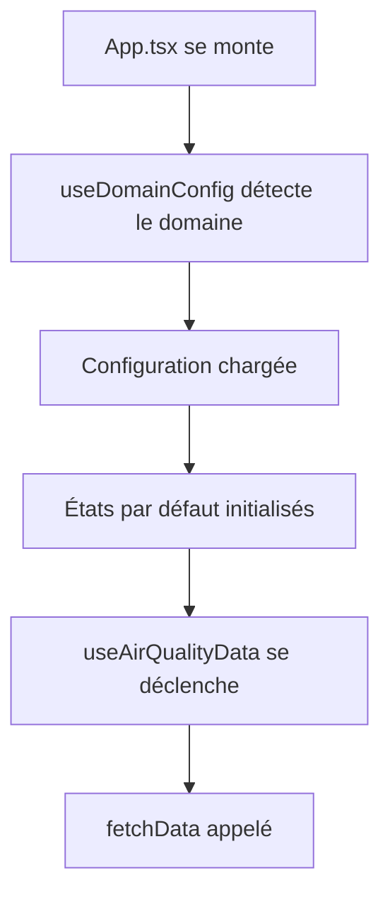
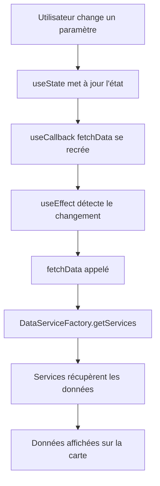
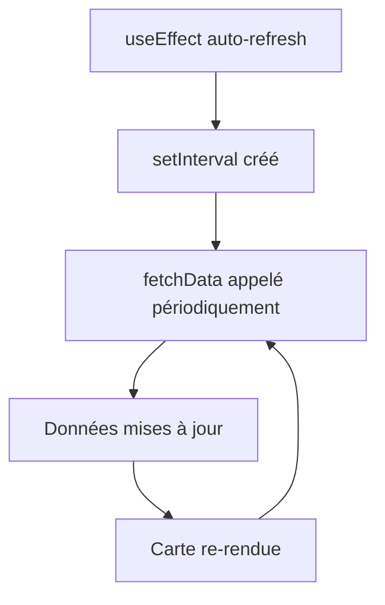
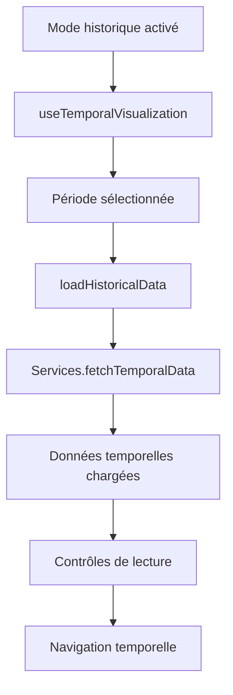

# Documentation Technique - ReactOpenAirMap

## Table des matières

1. [Vue d'ensemble de l'architecture](#vue-densemble-de-larchitecture)
2. [Hooks React utilisés](#hooks-react-utilisés)
3. [Architecture des services de données](#architecture-des-services-de-données)
4. [Flux de données](#flux-de-données)
5. [Types TypeScript](#types-typescript)
6. [Patterns de conception](#patterns-de-conception)
7. [Gestion d'état](#gestion-détat)
8. [Performance et optimisations](#performance-et-optimisations)

## Vue d'ensemble de l'architecture

ReactOpenAirMap est une application React/TypeScript qui affiche des données de qualité de l'air sur une carte interactive. L'application utilise une architecture modulaire avec une séparation claire des responsabilités.

### Composants principaux

```
App.tsx (Composant racine)
├── Hooks personnalisés
│   ├── useAirQualityData (Gestion des données en temps réel)
│   ├── useTemporalVisualization (Mode historique)
│   └── useDomainConfig (Configuration par domaine)
├── Services de données (Pattern Factory)
│   ├── DataServiceFactory
│   ├── AtmoRefService, AtmoMicroService
│   ├── NebuleAirService, PurpleAirService
│   └── SensorCommunityService, SignalAirService
└── Composants UI
    ├── AirQualityMap (Carte Leaflet)
    ├── Controls (Menus déroulants)
    └── Panels (Affichage des détails)
```

### Principe de fonctionnement

1. **Configuration** : L'application se configure automatiquement selon le domaine d'accès
2. **Sélection** : L'utilisateur choisit polluant, sources et pas de temps
3. **Récupération** : Les services de données récupèrent les informations via APIs
4. **Affichage** : Les données sont affichées sur la carte avec des marqueurs colorés
5. **Mise à jour** : Auto-refresh selon le pas de temps sélectionné

## Hooks React utilisés

### useState - Gestion d'état local

```typescript
const [selectedPollutant, setSelectedPollutant] = useState<string>(
  getDefaultPollutant()
);
const [devices, setDevices] = useState<MeasurementDevice[]>([]);
```

**Principe** : `useState` permet de gérer un état local dans un composant fonctionnel. Chaque appel retourne un tableau avec :

- `[0]` : La valeur actuelle de l'état
- `[1]` : Une fonction pour mettre à jour l'état

**Utilisation dans l'app** :

- États des contrôles (polluant, sources, pas de temps)
- Données récupérées (devices, reports)
- États de chargement et d'erreur

### useEffect - Effets de bord

```typescript
useEffect(() => {
  fetchData();
}, [fetchData]);

useEffect(() => {
  if (intervalRef.current) {
    clearInterval(intervalRef.current);
    intervalRef.current = null;
  }

  if (!autoRefreshEnabled || selectedSources.length === 0) {
    return;
  }

  const refreshInterval = getRefreshInterval(selectedTimeStep);
  intervalRef.current = setInterval(() => {
    fetchData();
  }, refreshInterval) as any;

  return () => {
    if (intervalRef.current) {
      clearInterval(intervalRef.current);
      intervalRef.current = null;
    }
  };
}, [selectedTimeStep, selectedSources, autoRefreshEnabled, fetchData]);
```

**Principe** : `useEffect` exécute des effets de bord (appels API, souscriptions, timers) après le rendu.

**Paramètres** :

- **Fonction** : Code à exécuter
- **Dépendances** : Tableau des valeurs à surveiller
- **Cleanup** : Fonction retournée pour nettoyer (timers, souscriptions)

**Utilisation dans l'app** :

- Chargement initial des données
- Auto-refresh avec `setInterval`
- Nettoyage des timers
- Synchronisation des états

### useCallback - Mémorisation des fonctions

```typescript
const fetchData = useCallback(async () => {
  // Logique de récupération des données
}, [
  selectedPollutant,
  selectedSources,
  selectedTimeStep,
  signalAirPeriod,
  mobileAirPeriod,
  selectedMobileAirSensor,
]);
```

**Principe** : `useCallback` mémorise une fonction et ne la recrée que si ses dépendances changent.

**Avantages** :

- Évite les re-renders inutiles des composants enfants
- Optimise les performances
- Stabilise les références de fonctions

**Utilisation dans l'app** :

- Fonction `fetchData` dans `useAirQualityData`
- Handlers de navigation temporelle
- Fonctions de nettoyage

### useRef - Références persistantes

```typescript
const intervalRef = useRef<number | null>(null);
const atmoMicroService = useRef(new AtmoMicroService());
```

**Principe** : `useRef` crée une référence mutable qui persiste entre les rendus sans déclencher de re-render.

**Utilisation dans l'app** :

- Stockage des IDs d'intervalles (`setInterval`)
- Instances de services (évite la recréation)
- Références DOM (si nécessaire)

### useMemo - Mémorisation des calculs

```typescript
const defaultTimeStep = useMemo(() => {
  const defaultTimeStep = Object.entries(pasDeTemps).find(
    ([_, timeStep]) => timeStep.activated
  );
  return defaultTimeStep ? defaultTimeStep[0] : "heure";
}, []);

const defaultSignalAirPeriod = useMemo(() => {
  const end = new Date();
  const start = new Date();
  start.setDate(start.getDate() - 2);

  return {
    startDate: start.toISOString().split("T")[0],
    endDate: end.toISOString().split("T")[0],
  };
}, []);
```

**Principe** : `useMemo` mémorise le résultat d'un calcul coûteux et ne le recalcule que si les dépendances changent.

**Utilisation dans l'app** :

- Calculs de valeurs par défaut
- Transformations de données complexes
- Optimisation des performances

## Architecture des services de données

### Pattern Factory

L'application utilise le pattern Factory pour gérer les différents services de données :

```typescript
export class DataServiceFactory {
  private static services: Map<string, DataService> = new Map();

  static getService(sourceCode: string): DataService {
    if (!this.services.has(sourceCode)) {
      let service: DataService;

      switch (sourceCode) {
        case "atmoRef":
          service = new AtmoRefService();
          break;
        case "atmoMicro":
          service = new AtmoMicroService();
          break;
        case "nebuleair":
          service = new NebuleAirService();
          break;
        // ... autres services
        default:
          throw new Error(`Service non supporté pour la source: ${sourceCode}`);
      }

      this.services.set(sourceCode, service);
    }

    return this.services.get(sourceCode)!;
  }

  static getServices(sourceCodes: string[]): DataService[] {
    return sourceCodes.map((code) => this.getService(code));
  }
}
```

**Avantages du pattern Factory** :

- **Encapsulation** : Cache la logique de création des services
- **Singleton** : Une seule instance par service (via Map)
- **Extensibilité** : Facile d'ajouter de nouveaux services
- **Type safety** : Interface commune `DataService`

### Interface commune DataService

```typescript
export interface DataService {
  fetchData(params: {
    pollutant: string;
    timeStep: string;
    sources: string[];
    signalAirPeriod?: { startDate: string; endDate: string };
    mobileAirPeriod?: { startDate: string; endDate: string };
    selectedSensors?: string[];
  }): Promise<MeasurementDevice[] | SignalAirReport[]>;
}
```

**Principe** : Tous les services implémentent la même interface, garantissant une utilisation cohérente.

### Services disponibles

1. **AtmoRefService** : Données de référence AtmoSud
2. **AtmoMicroService** : Données micro-capteurs AtmoSud
3. **NebuleAirService** : Données communautaires NebuleAir
4. **PurpleAirService** : Données capteurs PurpleAir
5. **SensorCommunityService** : Données Sensor.Community
6. **SignalAirService** : Signalements citoyens
7. **MobileAirService** : Données capteurs mobiles

## Flux de données

### 1. Initialisation



### 2. Sélection utilisateur



### 3. Auto-refresh



### 4. Mode historique



## Types TypeScript

### Types principaux

```typescript
// Appareil de mesure
export interface MeasurementDevice {
  id: string;
  name: string;
  latitude: number;
  longitude: number;
  source: string;
  pollutant: string;
  value: number;
  unit: string;
  timestamp: string;
  status: "active" | "inactive" | "error";
  qualityLevel?: string;
  address?: string;
  departmentId?: string;
  // Propriétés pour les valeurs corrigées (AtmoMicro)
  corrected_value?: number;
  raw_value?: number;
  has_correction?: boolean;
}

// Signalement SignalAir
export interface SignalAirReport {
  id: string;
  latitude: number;
  longitude: number;
  source: string;
  timestamp: string;
  signalType: string;
  signalDescription: string;
}

// Point temporel pour le mode historique
export interface TemporalDataPoint {
  timestamp: string;
  devices: MeasurementDevice[];
  deviceCount: number;
  averageValue: number;
  qualityLevels: Record<string, number>;
}
```

### Configuration par domaine

```typescript
export interface DomainConfig {
  logo: string;
  mapCenter: [number, number];
  mapZoom: number;
  title: string;
  links: {
    website: string;
    contact: string;
    about?: string;
  };
  organization: string;
}
```

## Patterns de conception

### 1. Hook personnalisé

```typescript
export const useAirQualityData = ({
  selectedPollutant,
  selectedSources,
  selectedTimeStep,
}: // ... autres paramètres
UseAirQualityDataProps) => {
  // État local
  const [devices, setDevices] = useState<MeasurementDevice[]>([]);
  const [loading, setLoading] = useState(false);

  // Logique métier
  const fetchData = useCallback(async () => {
    // ...
  }, [dépendances]);

  // Effets
  useEffect(() => {
    fetchData();
  }, [fetchData]);

  // Retour de l'interface publique
  return {
    devices,
    loading,
    error,
    lastRefresh,
  };
};
```

**Avantages** :

- **Réutilisabilité** : Logique partagée entre composants
- **Testabilité** : Logique isolée et testable
- **Lisibilité** : Code plus clair et organisé

### 2. Gestion d'erreur

```typescript
try {
  const data = await service.fetchData(params);
  // Traitement des données
} catch (err) {
  console.error(`❌ Erreur pour ${sourceCode}:`, err);
  // En cas d'erreur, on garde les données existantes
} finally {
  setLoadingSources((prev) => prev.filter((source) => source !== sourceCode));
}
```

**Principe** : Gestion gracieuse des erreurs sans interrompre l'expérience utilisateur.

### 3. Nettoyage des ressources

```typescript
useEffect(() => {
  // Configuration
  const interval = setInterval(() => {
    fetchData();
  }, refreshInterval);

  // Cleanup
  return () => {
    if (interval) {
      clearInterval(interval);
    }
  };
}, [dépendances]);
```

**Principe** : Toujours nettoyer les ressources (timers, souscriptions) pour éviter les fuites mémoire.

## Gestion d'état

### État local vs global

**État local (useState)** :

- États spécifiques à un composant
- Données temporaires
- États d'interface (loading, error)

**État partagé** :

- Configuration par domaine
- Données de qualité de l'air
- Paramètres de sélection

### Synchronisation des états

```typescript
// Synchronisation du timeStep
useEffect(() => {
  setState((prev) => {
    if (prev.data.length > 0 && prev.timeStep !== timeStep) {
      return {
        ...prev,
        timeStep: timeStep,
        data: [], // Réinitialiser les données
        currentDate: "",
        isPlaying: false,
        error: null,
      };
    }
    return { ...prev, timeStep: timeStep };
  });
}, [timeStep]);
```

## Performance et optimisations

### 1. Mémorisation

```typescript
// Évite la recréation de fonctions
const fetchData = useCallback(async () => {
  // ...
}, [dépendances]);

// Évite les calculs coûteux
const defaultTimeStep = useMemo(() => {
  return (
    Object.entries(pasDeTemps).find(
      ([_, timeStep]) => timeStep.activated
    )?.[0] || "heure"
  );
}, []);
```

### 2. Debouncing

```typescript
// Auto-refresh avec intervalle adaptatif
const getRefreshInterval = (timeStep: string): number => {
  const code = pasDeTemps[timeStep]?.code || timeStep;
  switch (code) {
    case "instantane": // Scan
    case "2min": // ≤ 2 minutes
      return 60 * 1000; // 60 secondes
    case "qh": // 15 minutes
      return 15 * 60 * 1000; // 15 minutes
    case "h": // Heure
      return 60 * 60 * 1000; // 60 minutes
    case "d": // Jour
      return 24 * 60 * 60 * 1000; // 24 heures
    default:
      return 60 * 1000; // Par défaut, 60 secondes
  }
};
```

### 3. Chargement progressif

```typescript
// Traitement séquentiel pour affichage progressif
for (let i = 0; i < services.length; i++) {
  const service = services[i];
  try {
    const data = await service.fetchData(params);
    // Mise à jour immédiate des données
    setDevices((prevDevices) => {
      const filteredDevices = prevDevices.filter(
        (device) => device.source !== mappedSourceCode
      );
      return [...filteredDevices, ...measurementDevices];
    });
  } catch (err) {
    // Gestion d'erreur sans interrompre les autres services
  }
}
```

### 4. Nettoyage des données

```typescript
// Suppression des données obsolètes
setDevices((prevDevices) => {
  const filteredDevices = prevDevices.filter((device) => {
    return mappedSources.includes(device.source);
  });
  return filteredDevices;
});
```

## Bonnes pratiques implémentées

### 1. Type Safety

- Utilisation de TypeScript pour tous les composants
- Interfaces strictes pour les données
- Types optionnels pour les propriétés non obligatoires

### 2. Gestion d'erreur robuste

- Try-catch dans tous les appels async
- Messages d'erreur informatifs
- Fallback gracieux en cas d'échec

### 3. Performance

- Mémorisation avec useCallback/useMemo
- Nettoyage des ressources
- Chargement progressif des données

### 4. Maintenabilité

- Séparation des responsabilités
- Hooks personnalisés réutilisables
- Pattern Factory pour l'extensibilité

### 5. Expérience utilisateur

- États de chargement visuels
- Auto-refresh intelligent
- Gestion des erreurs transparente
